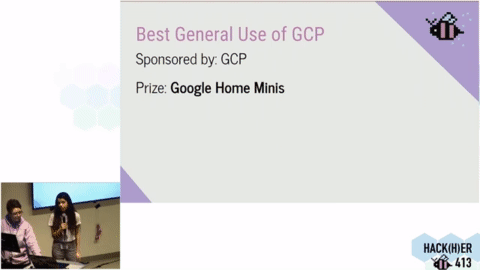

# Shazam 4 Petz!

Live Website: [https://shazam4petz.github.io/](https://shazam4petz.github.io/)

## Our Team

On Feb 09, 2019, our team was formed at the 2-day [Hack(H)er413](https://www.hackher413.com/) Hackathon hosted at [UMass Amherst](https://www.umass.edu/) out of our mutual love for animals and interest in tackling animal-related issues.

* [Miffy Chen](https://miffychen.tech/): Website, Integration, Google Cloud Platform, Design
* [Anna Mun](https://shazam4petz.github.io/aboutus/index.html): Cloud Vision API
* [Qing Zhao](https://shazam4petz.github.io/aboutus/index.html): AutoML Model
* [Stephanie Murphy](https://shazam4petz.github.io/aboutus/index.html): REST API

## The Problem

According to an article in the [Smithsonian](https://www.smithsonianmag.com/smart-news/genetic-testing-shows-animal-shelters-often-misidentify-dogs-breeds-180970136/) (2018), there are roughly 3.3 million dogs that enter animal shelters in the U.S. each year, but only an alarming **67%** were correctly identified of their primary or secondary breed by shelter staffs. Leaving **over 1.089 million dogs** across the country to be **misidentified or mislabeled** yearly.

Currently, there are no standardized procedures across shelters nationwide when identifying breeds of dogs and cats. The accuracy rate for breed-identification varies significantly from shelter to shelter, and staff to staff. [Studies show](https://www.vetmed.ufl.edu/2016/02/17/dna-studies-reveal-that-shelter-workers-often-mislabel-dogs-as-pit-bulls/) that as high as **48%** of dogs with no genetic evidence of being Pit Bulls have been misidentified as **Pit Bull**-type dogs - one of the **most commonly restricted dog breeds** of many "pet-friendly" rental properties.

**Inaccurate breed identifications of shelter animals drastically limit their pool of potential adopters, and as a result, lowers their chances of being adopted.**

<!--

Inaccurate breed-identification drastically reduces the pool of potential adopters as **Pit Bulls** are the **most commonly restricted dog breed** of many "pet-friendly" rental properties, leading to *much* **lower rates of adoption** for mislabeled dogs.

In the dogs that are mislabeled, [many](https://www.vetmed.ufl.edu/2016/02/17/dna-studies-reveal-that-shelter-workers-often-mislabel-dogs-as-pit-bulls/) are be labeled as **Pit Bulls**, a **commonly restricted dog breed** for many rental properties. This deadly mix-up costs <u>**limits their pool of potential adopters**</u>, and <u>**dramatically lowers their chances of being adopted**</u>.

Aside from the issue of breed-specific bans on pets (also hugely problematic), mislabeling dogs as unfavorable breeds directly **strips them of possibilities to be adopted**.

Sadly, this is not something we can reverse within a weekend. However, we *can* start by building a user-friendly tool that accurately <u>identifies possible breed combinations and percentages using a custom-trained Machine Learning Model.</u>

-->

## Our Mission

Create a high-accuracy tool for shelters to **correctly identify breed combinations and percentages** of cross and mixed-bred dogs and cats using `machine learning`, and help **raise adoption rates** of shelter animals as a result.

<!--
## Our Results

-->

## Our Awards

| :trophy: [Best Use of Google Cloud Platform](https://twitter.com/MLHacks/status/1094702441151545344) | :trophy: Best Almost Hack |
| :---: | :---: |
|  |  |

<!-- |  |  | -->

## Tech Stacks

* [Firebase](https://firebase.google.com/): Cloud Storage, Realtime Database, User Authentication
* [Google Cloud Vision API](https://cloud.google.com/vision/): Image Analysis
* [Google Cloud AutoML Vision](https://cloud.google.com/vision/automl/docs/): Custom Machine Learning Model Training
* [Google Cloud Functions](https://cloud.google.com/functions/): Serverless Application Scripts
* [Google Colab](https://colab.research.google.com/): Collaborative Python IDE

## Future Development

* Further train our Model with more data, improving its precision as it scales
* Implement a validation/filtering algorithm for photos uploaded by users, and store approved photos to our database for our Model
* iOS & Android Apps, allowing photos taken via mobile phones to be analyzed direct within our app
* Using the Wolfram Alpha API, provide users with health information specifically related to various mix-breeds of dogs and cats
* Expand our service to other species of shelter animals
